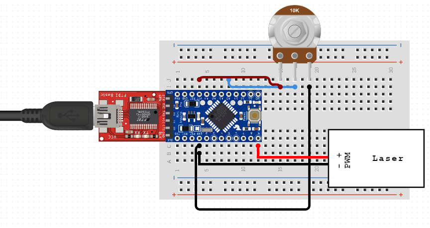

## Control Laser with PWM using Arduino

Disclaimer: I am not responsible for damage to property of life due to operation of a laser using this sketch. Software is provided as is. Use at your own risk.

Always wear safety glasses whenever working with lasers of any power.

Prepare your workspace such that accidents cannot occur, and no laser modules will slip out of your control

